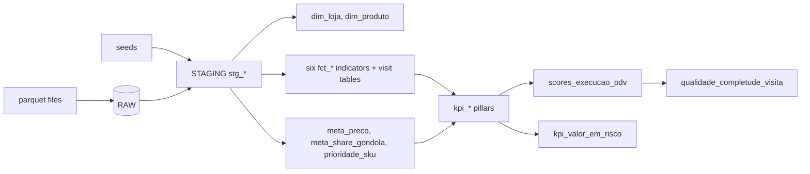

# Architecture

## Layers and the original medallion

The original Databricks project used bronze, silver and gold. Here the same ideas live in schemas of one database per environment (`AISLEIQ_DEV`, `AISLEIQ_PROD`).

| Original (Databricks) | Here (Snowflake + dbt) | Built by | Content |
|---|---|---|---|
| Landing volume | `RAW.LANDING` (internal stage) | `ingestion/ingest.py` (`PUT`) | Daily parquet files, never overwritten |
| bronze | `RAW` | `ingestion/ingest.py` (`COPY INTO`) | Daily facts as loaded, plus `source_file`, `source_date`, `ingested_at` |
| bronze (master data) | `SEEDS` | `dbt seed` | Stores, products and their lookups, versioned CSVs |
| silver | `STAGING` | dbt models `stg_*` | Typing, dedupe, quality flags (`resposta_valida`) |
| gold | `MARTS` | dbt models `dim_*`, `fct_*`, `kpi_*`, scores | Indicators, dimensions, targets, execution score |

The original numbered notebooks of the score graph (`00_` to `08_`) became `ref()` dependencies; dbt orders the build.

## Roles and environments

- `AISLEIQ_LOADER` writes to `RAW`; `AISLEIQ_TRANSFORMER` reads `RAW` and writes to `SEEDS`, `STAGING` and `MARTS`. One X-Small warehouse with a 60 s auto-suspend and a resource monitor.
- Dev is the default dbt target. Prod is built only by the scheduled workflow (`docs/orchestration.md`).
- Authentication is by key pair, with no password. Secrets stay outside the repository.

## Lineage



The model-level lineage is generated by dbt. After a run with `--docs` (or `dbt docs generate`), open it with:

```bash
(cd dbt && DBT_PROFILES_DIR=. dbt docs serve)
```

The daily workflow also uploads the generated site (`index.html`, `manifest.json`, `catalog.json`) as the `dbt-docs` artifact, kept for 30 days.

## Related

- Data dictionary: `docs/indicators.md`. Conventions and decisions: `docs/dbt-conventions.md`. SQL differences: `docs/dialect-guide.md`.
